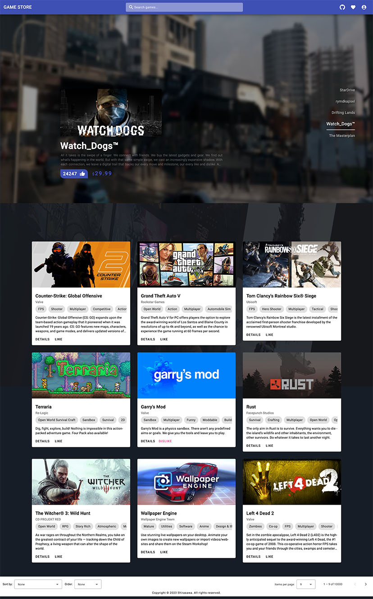
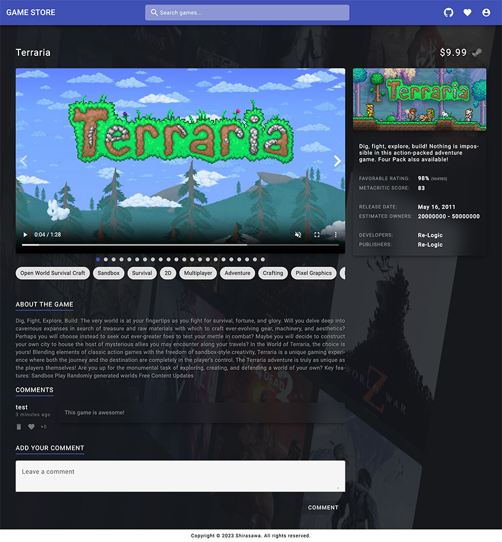

# Game Store

A simple homework for my Full Stack Developer course.

**You can see the full documents on Github repo: [ShirasawaSama/GameStore](https://github.com/ShirasawaSama/GameStore)**

## Tech Stack

- Flask
- MongoDB
- Docker
- Docker Compose
- Angular
- Angular Material
- Pytest

## Screenshots





## Installation

### Pre-requisites

- Docker
- Docker Compose
- Nodejs

### Steps

```bash
git clone https://github.com/ShirasawaSama/GameStore.git

cd GameStore
```

#### Frontend

> Because the submission requirements for homework require separate zip compression of the front and back ends, I divided them into two folders, where the front end was not built using Docker.

```bash
cd frontend

npm install

npm run build
```

Then copy all files of `frontend/dist/browser` to `backend/static`.

#### Backend

```bash
cd backend

COMPOSE_PROFILES=prod docker-compose up -d
```

Then open `http://localhost:5000` in your browser.

## Test

```
cd backend

python -m pytest

cd ../frontend

npm test
```

## Author

Shirasawa

## License

[AGPL3.0](./LICENSE)
